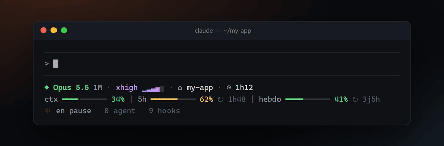
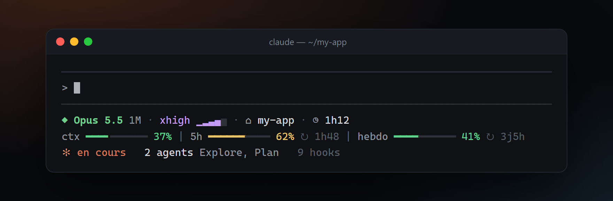
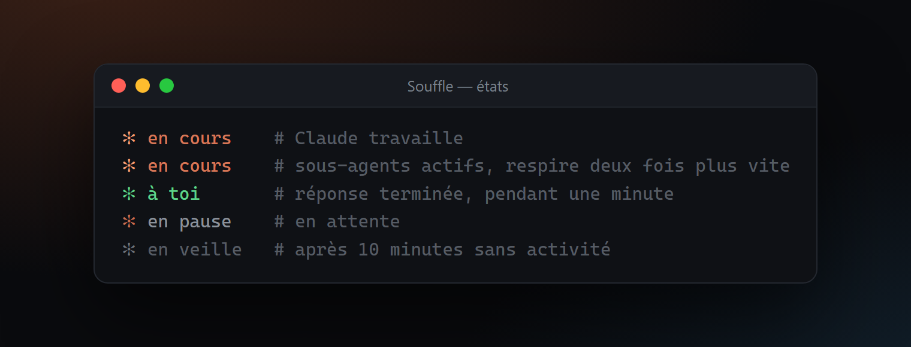

<div align="center">

# ✻ Souffle — statusline

**Une statusline qui respire, pour Claude Code.**

Modèle, niveau de réflexion, jauges de contexte et de quotas d'un coup d'œil,<br>
et une étincelle qui respire au rythme de Claude.

[](https://github.com/a8naaijetvi2lunk/souffle-statusline/actions/workflows/ci.yml)


[](LICENSE)



[English](README.md) · **Français**

</div>

## Installation

```bash
npx -y github:a8naaijetvi2lunk/souffle-statusline
```

Relancez ensuite Claude Code : les hooks sont chargés au démarrage.

Il faut Claude Code et Node.js 20 ou plus récent. Souffle fonctionne sous macOS, Linux et Windows.

Pour voir avant d'installer, lancez l'aperçu dans votre terminal. Rien n'est écrit :

```bash
npx -y github:a8naaijetvi2lunk/souffle-statusline preview --live --lang fr
```

## Ce qui s'affiche



| Ligne | Contenu |
|---|---|
| 1 | Le modèle, coloré par famille (Opus, Sonnet, Haiku, Fable), avec `1M` quand la fenêtre de contexte d'un million de tokens est active. Le niveau de réflexion en jauge à cinq crans. Le dossier courant. La durée de la session. |
| 2 | Le contexte utilisé, puis les quotas 5 heures et hebdomadaire avec le temps restant avant leur remise à zéro. |
| 3 | L'étincelle et ce que fait Claude, les sous-agents en cours avec leur nom, et le nombre de hooks configurés. |

Les jauges passent à l'orange à 50 % et au rouge à 80 %. Les quotas s'affichent pour les abonnements Pro et Max, après la première réponse de la session.

## L'étincelle



Un seul symbole, `✻`, qui ne change jamais de forme. La statusline se rafraîchit chaque seconde et la couleur de l'étincelle monte et redescend avec elle. La couleur et le rythme indiquent l'état :

| État | Couleur | Une respiration |
|---|---|---|
| en cours | orange Claude | 4 s |
| en cours, avec des sous-agents | orange Claude | 2 s |
| à toi | vert | 4 s, pendant une minute après chaque réponse |
| en pause | orange doux | 6 s |
| en veille | gris | 10 s, après 10 minutes sans activité |

## Ce que modifie l'installation

1. Copie quatre fichiers dans `~/.claude/souffle/` (ou `$CLAUDE_CONFIG_DIR/souffle/`).
2. Sauvegarde `settings.json` en `settings.json.souffle-backup-<date>`.
3. Fait pointer `statusLine` vers `souffle/statusline.mjs` avec `refreshInterval: 1`. Votre statusline précédente est conservée et revient à la désinstallation.
4. Ajoute une commande de hook sur `UserPromptSubmit`, `Stop`, `SubagentStart`, `SubagentStop` et `SessionEnd`. Vos propres hooks restent tels quels.

Relancer l'installation met Souffle à jour sur place. Si `settings.json` n'est pas un JSON valide, elle s'arrête avant d'écrire quoi que ce soit.

Les hooks tiennent quelques petits fichiers JSON dans `~/.claude/souffle/state/` : début et fin de chaque tour, sous-agents en cours. Rien ne quitte votre machine. Aucun accès réseau, aucune dépendance.

## Réglages

| Variable | Valeurs | Par défaut |
|---|---|---|
| `SOUFFLE_LANG` | `en`, `fr` | Le réglage `language` de Claude Code, puis la langue du système |
| `SOUFFLE_COLOR` | `truecolor`, `256`, `none` | `truecolor`, ou `256` dans Terminal d'Apple |
| `NO_COLOR` | n'importe quelle valeur | Couleurs actives |

À placer dans le bloc `env` de `~/.claude/settings.json` :

```json
{
  "env": { "SOUFFLE_LANG": "fr" }
}
```

## Désinstallation

```bash
npx -y github:a8naaijetvi2lunk/souffle-statusline uninstall
```

Retire les hooks et le dossier `souffle`, et remet la statusline que vous aviez avant.

## En cas de souci

- **L'étincelle ne réagit pas aux messages.** Relancez Claude Code pour qu'il charge les hooks. D'ici là, Souffle déduit l'activité du transcript de la session.
- **Rien ne bouge entre deux réponses.** Vérifiez que `statusLine` contient `"refreshInterval": 1` dans `settings.json`.
- **`5h` et `hebdo` affichent `—`.** Claude Code n'envoie les quotas qu'aux abonnements Pro et Max, après la première réponse.
- **Des carrés à la place des symboles.** Prenez une police qui contient les caractères de dessin de boîtes et les formes géométriques : Cascadia Code, JetBrains Mono, SF Mono ou Menlo conviennent.
- **Les couleurs sont fausses.** Mettez `SOUFFLE_COLOR` à `256`.
- **Une longue réponse affiche « en pause ».** Une génération qui n'écrit rien pendant 3 minutes repasse en pause jusqu'à la prochaine écriture de Claude.

## Développement

```bash
git clone https://github.com/a8naaijetvi2lunk/souffle-statusline
cd souffle-statusline
npm test          # node:test, sans dépendance
npm run preview   # aperçu animé dans le terminal
npm run capture   # régénère les images de assets/ (Chrome et ffmpeg requis)
```

Les images de ce README viennent du vrai rendu : `scripts/capture.mjs` fait tourner `src/statusline.mjs` sur des sessions d'exemple, dessine la sortie dans un terminal HTML et l'enregistre avec Chrome sans interface.

## Licence

[MIT](LICENSE). Souffle est un projet indépendant, sans lien avec Anthropic.
