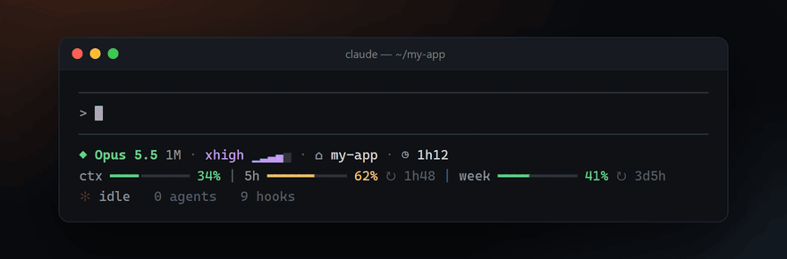
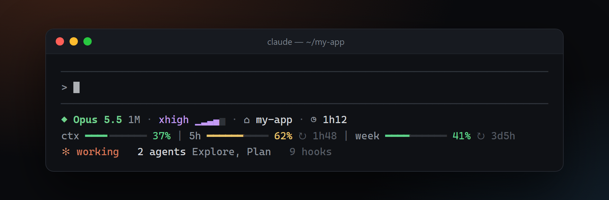
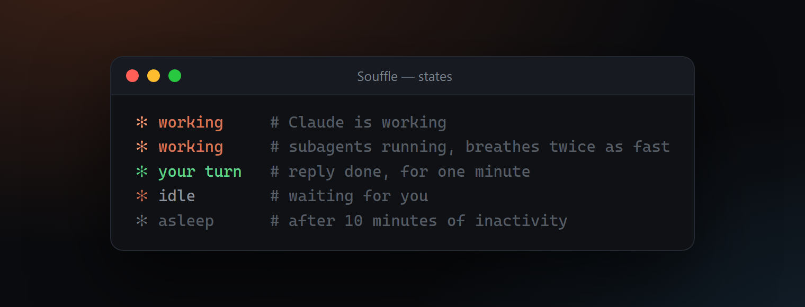

<div align="center">

# ✻ Souffle — statusline

**A breathing status line for Claude Code.**

Model, effort, context and quota gauges at a glance,<br>
and a spark that breathes with what Claude is doing.

[](https://github.com/a8naaijetvi2lunk/souffle-statusline/actions/workflows/ci.yml)


[](LICENSE)



**English** · [Français](README.fr.md)

</div>

## Install

```bash
npx -y github:a8naaijetvi2lunk/souffle-statusline
```

Then restart Claude Code: hooks are loaded at startup.

You need Claude Code and Node.js 20 or later. Souffle runs on macOS, Linux and Windows.

To look before installing, play it in your terminal. Nothing is written:

```bash
npx -y github:a8naaijetvi2lunk/souffle-statusline preview --live
```

## What you see



| Line | Shows |
|---|---|
| 1 | Model, coloured by family (Opus, Sonnet, Haiku, Fable), with `1M` when the 1M context window is on. Reasoning effort as a five-step gauge. Current folder. Session time. |
| 2 | Context window used, then the 5-hour and weekly quotas with the time left before they reset. |
| 3 | The breathing spark and what Claude is doing, the subagents running right now, and how many hooks you have configured. |

Gauges turn amber at 50 % and red at 80 %. Quotas show up for Pro and Max plans, after the first reply of a session.

## The spark



One glyph, `✻`, that never changes shape. The status line refreshes once per second and the spark's colour rises and falls with it. Colour and rhythm tell you the state:

| State | Colour | One breath |
|---|---|---|
| working | Claude orange | 4 s |
| working, with subagents | Claude orange | 2 s |
| your turn | green | 4 s, for a minute after each reply |
| idle | soft orange | 6 s |
| asleep | grey | 10 s, after 10 minutes without activity |

## What the installer changes

1. Copies four files to `~/.claude/souffle/` (or `$CLAUDE_CONFIG_DIR/souffle/`).
2. Backs up `settings.json` to `settings.json.souffle-backup-<date>`.
3. Points `statusLine` at `souffle/statusline.mjs` with `refreshInterval: 1`. Your previous status line is saved and comes back when you uninstall.
4. Adds one hook command on `UserPromptSubmit`, `Stop`, `SubagentStart`, `SubagentStop` and `SessionEnd`. Your own hooks stay as they are.

Running the installer again updates Souffle in place. If `settings.json` is not valid JSON, it stops before writing anything.

The hooks keep a few small JSON files in `~/.claude/souffle/state/`: when a turn starts and ends, and which subagents are running. Nothing leaves your machine. There is no network access and no dependency.

## Settings

| Variable | Values | Default |
|---|---|---|
| `SOUFFLE_LANG` | `en`, `fr` | The `language` setting of Claude Code, then your system locale |
| `SOUFFLE_COLOR` | `truecolor`, `256`, `none` | `truecolor`, or `256` in Apple Terminal |
| `NO_COLOR` | any value | Colours on |

Put them in the `env` block of `~/.claude/settings.json`:

```json
{
  "env": { "SOUFFLE_LANG": "fr" }
}
```

## Uninstall

```bash
npx -y github:a8naaijetvi2lunk/souffle-statusline uninstall
```

This removes the hooks and the `souffle` folder, and restores the status line you had before.

## Troubleshooting

- **The spark does not react to prompts.** Restart Claude Code so it loads the hooks. Until then, Souffle guesses activity from the session transcript.
- **Nothing moves between replies.** Check that `statusLine` has `"refreshInterval": 1` in `settings.json`.
- **`5h` and `week` show `—`.** Claude Code only sends quotas for Pro and Max plans, after the first reply.
- **Boxes instead of symbols.** Use a font with box-drawing and geometric shapes: Cascadia Code, JetBrains Mono, SF Mono or Menlo all work.
- **Colours look wrong.** Set `SOUFFLE_COLOR` to `256`.
- **A long reply shows `idle`.** A single generation that writes nothing for 3 minutes falls back to idle until Claude writes again.

## Develop

```bash
git clone https://github.com/a8naaijetvi2lunk/souffle-statusline
cd souffle-statusline
npm test          # node:test, no dependencies
npm run preview   # live preview in your terminal
npm run capture   # rebuild the images in assets/ (needs Chrome and ffmpeg)
```

The images in this README come from the real renderer: `scripts/capture.mjs` feeds sample sessions to `src/statusline.mjs`, draws the output in an HTML terminal and records it with headless Chrome.

## License

[MIT](LICENSE). Souffle is an independent project, not affiliated with Anthropic.
